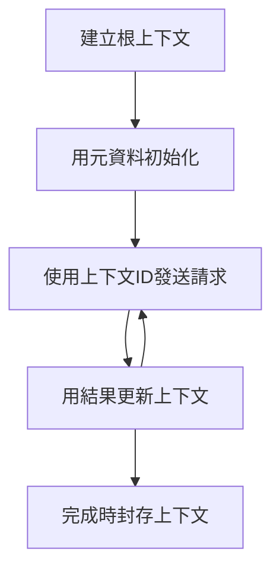

> [已棄用：2026-07-28 發行候選版本](https://blog.modelcontextprotocol.io/posts/2026-07-28-release-candidate/#roots-sampling-and-logging-are-deprecated)

# MCP 根上下文

> **棄用通知：** `2026-07-28` MCP 規範發行候選版本標示 Roots 已被棄用，建議改用工具參數、資源 URI 或伺服器設定。Roots 在 `2025-11-25` 版本及任一正式棄用至少一年後依然有效，因此本課程內容仍然適用 —— 但新的伺服器設計應評估替代模式。詳見 [MCP 更新內容：2026-07-28 發行候選版本](../../01-CoreConcepts/mcp-2026-07-28-release-candidate.md)。

根上下文是 Model Context Protocol 的基礎概念，提供一層持久化，用以維護多個請求和會話中的對話歷史和共享狀態。

## 介紹

本課程將探討如何在 MCP 中建立、管理及利用根上下文。

## 學習目標

完成本課程後，您將能夠：

- 理解根上下文的用途與結構
- 使用 MCP 客戶端程式庫建立及管理根上下文
- 在 .NET、Java、JavaScript 和 Python 應用程式中實作根上下文
- 利用根上下文進行多輪對話及狀態管理
- 實施根上下文管理的最佳實務

## 理解根上下文

根上下文作為容器，保存一系列相關互動的歷史與狀態。它們具備以下功能：

- <strong>對話持續性</strong>：維持連貫的多輪對話
- <strong>記憶管理</strong>：在互動間存取資訊
- <strong>狀態管理</strong>：追蹤複雜工作流程進度
- <strong>上下文共享</strong>：允許多個客戶端存取同一對話狀態

在 MCP 中，根上下文具有以下關鍵特性：

- 每個根上下文皆有唯一識別碼。
- 可包含對話歷史、使用者偏好及其他中繼資料。
- 可依需求建立、存取及封存。
- 支援細粒度存取控制與權限管理。

## 根上下文生命週期



## 使用根上下文

以下示範如何建立與管理根上下文。

### C# 實作

```csharp
// .NET Example: Root Context Management
using Microsoft.Mcp.Client;
using System;
using System.Threading.Tasks;
using System.Collections.Generic;

public class RootContextExample
{
    private readonly IMcpClient _client;
    private readonly IRootContextManager _contextManager;
    
    public RootContextExample(IMcpClient client, IRootContextManager contextManager)
    {
        _client = client;
        _contextManager = contextManager;
    }
    
    public async Task DemonstrateRootContextAsync()
    {
        // 1. Create a new root context
        var contextResult = await _contextManager.CreateRootContextAsync(new RootContextCreateOptions
        {
            Name = "Customer Support Session",
            Metadata = new Dictionary<string, string>
            {
                ["CustomerName"] = "Acme Corporation",
                ["PriorityLevel"] = "High",
                ["Domain"] = "Cloud Services"
            }
        });
        
        string contextId = contextResult.ContextId;
        Console.WriteLine($"Created root context with ID: {contextId}");
        
        // 2. First interaction using the context
        var response1 = await _client.SendPromptAsync(
            "I'm having issues scaling my web service deployment in the cloud.", 
            new SendPromptOptions { RootContextId = contextId }
        );
        
        Console.WriteLine($"First response: {response1.GeneratedText}");
        
        // Second interaction - the model will have access to the previous conversation
        var response2 = await _client.SendPromptAsync(
            "Yes, we're using containerized deployments with Kubernetes.", 
            new SendPromptOptions { RootContextId = contextId }
        );
        
        Console.WriteLine($"Second response: {response2.GeneratedText}");
        
        // 3. Add metadata to the context based on conversation
        await _contextManager.UpdateContextMetadataAsync(contextId, new Dictionary<string, string>
        {
            ["TechnicalEnvironment"] = "Kubernetes",
            ["IssueType"] = "Scaling"
        });
        
        // 4. Get context information
        var contextInfo = await _contextManager.GetRootContextInfoAsync(contextId);
        
        Console.WriteLine("Context Information:");
        Console.WriteLine($"- Name: {contextInfo.Name}");
        Console.WriteLine($"- Created: {contextInfo.CreatedAt}");
        Console.WriteLine($"- Messages: {contextInfo.MessageCount}");
        
        // 5. When the conversation is complete, archive the context
        await _contextManager.ArchiveRootContextAsync(contextId);
        Console.WriteLine($"Archived context {contextId}");
    }
}
```

在上述程式碼中，我們：

1. 為客戶支援會話建立根上下文。
1. 於該上下文中傳送多則訊息，使模型能維持狀態。
1. 根據對話更新上下文中的相關中繼資料。
1. 擷取上下文資訊以瞭解對話歷史。
1. 在對話完成後封存該上下文。

## 範例：金融分析的根上下文實作

此範例示範如何為金融分析會話建立根上下文，並演示如何在多次互動間維持狀態。

### Java 實作

```java
// Java 範例：根上下文實現
package com.example.mcp.contexts;

import com.mcp.client.McpClient;
import com.mcp.client.ContextManager;
import com.mcp.models.RootContext;
import com.mcp.models.McpResponse;

import java.util.HashMap;
import java.util.Map;
import java.util.UUID;

public class RootContextsDemo {
    private final McpClient client;
    private final ContextManager contextManager;
    
    public RootContextsDemo(String serverUrl) {
        this.client = new McpClient.Builder()
            .setServerUrl(serverUrl)
            .build();
            
        this.contextManager = new ContextManager(client);
    }
    
    public void demonstrateRootContext() throws Exception {
        // 建立上下文元數據
        Map<String, String> metadata = new HashMap<>();
        metadata.put("projectName", "Financial Analysis");
        metadata.put("userRole", "Financial Analyst");
        metadata.put("dataSource", "Q1 2025 Financial Reports");
        
        // 1. 建立新的根上下文
        RootContext context = contextManager.createRootContext("Financial Analysis Session", metadata);
        String contextId = context.getId();
        
        System.out.println("Created context: " + contextId);
        
        // 2. 第一次互動
        McpResponse response1 = client.sendPrompt(
            "Analyze the trends in Q1 financial data for our technology division",
            contextId
        );
        
        System.out.println("First response: " + response1.getGeneratedText());
        
        // 3. 使用從回應獲得的重要資訊更新上下文
        contextManager.addContextMetadata(contextId, 
            Map.of("identifiedTrend", "Increasing cloud infrastructure costs"));
        
        // 第二次互動 - 使用相同上下文
        McpResponse response2 = client.sendPrompt(
            "What's driving the increase in cloud infrastructure costs?",
            contextId
        );
        
        System.out.println("Second response: " + response2.getGeneratedText());
        
        // 4. 生成分析會議摘要
        McpResponse summaryResponse = client.sendPrompt(
            "Summarize our analysis of the technology division financials in 3-5 key points",
            contextId
        );
        
        // 將摘要儲存在上下文元數據中
        contextManager.addContextMetadata(contextId, 
            Map.of("analysisSummary", summaryResponse.getGeneratedText()));
            
        // 獲取更新的上下文資訊
        RootContext updatedContext = contextManager.getRootContext(contextId);
        
        System.out.println("Context Information:");
        System.out.println("- Created: " + updatedContext.getCreatedAt());
        System.out.println("- Last Updated: " + updatedContext.getLastUpdatedAt());
        System.out.println("- Analysis Summary: " + 
            updatedContext.getMetadata().get("analysisSummary"));
            
        // 5. 完成時歸檔上下文
        contextManager.archiveContext(contextId);
        System.out.println("Context archived");
    }
}
```

在上述程式碼中，我們：

1. 為金融分析會話建立根上下文。
2. 於該上下文中傳送多則訊息，使模型能維持狀態。
3. 根據對話更新上下文中的相關中繼資料。
4. 產生分析會話摘要並存入上下文中繼資料。
5. 在對話完成後封存該上下文。

## 範例：根上下文管理

有效管理根上下文對維持對話歷史和狀態至關重要。以下範例展示如何實作根上下文管理。

### JavaScript 實作

```javascript
// JavaScript 範例：管理 MCP 根上下文
const { McpClient, RootContextManager } = require('@mcp/client');

class ContextSession {
  constructor(serverUrl, apiKey = null) {
    // 初始化 MCP 用戶端
    this.client = new McpClient({
      serverUrl,
      apiKey
    });
    
    // 初始化上下文管理器
    this.contextManager = new RootContextManager(this.client);
  }
  
  /**
   * Create a new conversation context
   * @param {string} sessionName - Name of the conversation session
   * @param {Object} metadata - Additional metadata for the context
   * @returns {Promise<string>} - Context ID
   */
  async createConversationContext(sessionName, metadata = {}) {
    try {
      const contextResult = await this.contextManager.createRootContext({
        name: sessionName,
        metadata: {
          ...metadata,
          createdAt: new Date().toISOString(),
          status: 'active'
        }
      });
      
      console.log(`Created root context '${sessionName}' with ID: ${contextResult.id}`);
      return contextResult.id;
    } catch (error) {
      console.error('Error creating root context:', error);
      throw error;
    }
  }
  
  /**
   * Send a message in an existing context
   * @param {string} contextId - The root context ID
   * @param {string} message - The user's message
   * @param {Object} options - Additional options
   * @returns {Promise<Object>} - Response data
   */
  async sendMessage(contextId, message, options = {}) {
    try {
      // 使用指定的上下文發送訊息
      const response = await this.client.sendPrompt(message, {
        rootContextId: contextId,
        temperature: options.temperature || 0.7,
        allowedTools: options.allowedTools || []
      });
      
      // 可選地儲存對話中的重要見解
      if (options.storeInsights) {
        await this.storeConversationInsights(contextId, message, response.generatedText);
      }
      
      return {
        message: response.generatedText,
        toolCalls: response.toolCalls || [],
        contextId
      };
    } catch (error) {
      console.error(`Error sending message in context ${contextId}:`, error);
      throw error;
    }
  }
  
  /**
   * Store important insights from a conversation
   * @param {string} contextId - The root context ID
   * @param {string} userMessage - User's message
   * @param {string} aiResponse - AI's response
   */
  async storeConversationInsights(contextId, userMessage, aiResponse) {
    try {
      // 提取潛在的見解（在實際應用中會更複雜）
      const combinedText = userMessage + "\n" + aiResponse;
      
      // 用於識別潛在見解的簡單啟發法
      const insightWords = ["important", "key point", "remember", "significant", "crucial"];
      
      const potentialInsights = combinedText
        .split(".")
        .filter(sentence => 
          insightWords.some(word => sentence.toLowerCase().includes(word))
        )
        .map(sentence => sentence.trim())
        .filter(sentence => sentence.length > 10);
      
      // 將見解儲存在上下文元資料中
      if (potentialInsights.length > 0) {
        const insights = {};
        potentialInsights.forEach((insight, index) => {
          insights[`insight_${Date.now()}_${index}`] = insight;
        });
        
        await this.contextManager.updateContextMetadata(contextId, insights);
        console.log(`Stored ${potentialInsights.length} insights in context ${contextId}`);
      }
    } catch (error) {
      console.warn('Error storing conversation insights:', error);
      // 非關鍵錯誤，僅記錄警告
    }
  }
  
  /**
   * Get summary information about a context
   * @param {string} contextId - The root context ID
   * @returns {Promise<Object>} - Context information
   */
  async getContextInfo(contextId) {
    try {
      const contextInfo = await this.contextManager.getContextInfo(contextId);
      
      return {
        id: contextInfo.id,
        name: contextInfo.name,
        created: new Date(contextInfo.createdAt).toLocaleString(),
        lastUpdated: new Date(contextInfo.lastUpdatedAt).toLocaleString(),
        messageCount: contextInfo.messageCount,
        metadata: contextInfo.metadata,
        status: contextInfo.status
      };
    } catch (error) {
      console.error(`Error getting context info for ${contextId}:`, error);
      throw error;
    }
  }
  
  /**
   * Generate a summary of the conversation in a context
   * @param {string} contextId - The root context ID
   * @returns {Promise<string>} - Generated summary
   */
  async generateContextSummary(contextId) {
    try {
      // 請模型生成迄今為止對話的摘要
      const response = await this.client.sendPrompt(
        "Please summarize our conversation so far in 3-4 sentences, highlighting the main points discussed.",
        { rootContextId: contextId, temperature: 0.3 }
      );
      
      // 將摘要儲存在上下文元資料中
      await this.contextManager.updateContextMetadata(contextId, {
        conversationSummary: response.generatedText,
        summarizedAt: new Date().toISOString()
      });
      
      return response.generatedText;
    } catch (error) {
      console.error(`Error generating context summary for ${contextId}:`, error);
      throw error;
    }
  }
  
  /**
   * Archive a context when it's no longer needed
   * @param {string} contextId - The root context ID
   * @returns {Promise<Object>} - Result of the archive operation
   */
  async archiveContext(contextId) {
    try {
      // 在歸檔前生成最終摘要
      const summary = await this.generateContextSummary(contextId);
      
      // 歸檔上下文
      await this.contextManager.archiveContext(contextId);
      
      return {
        status: "archived",
        contextId,
        summary
      };
    } catch (error) {
      console.error(`Error archiving context ${contextId}:`, error);
      throw error;
    }
  }
}

// 範例用法
async function demonstrateContextSession() {
  const session = new ContextSession('https://mcp-server-example.com');
  
  try {
    // 1. 為產品支援對話建立新的上下文
    const contextId = await session.createConversationContext(
      'Product Support - Database Performance',
      {
        customer: 'Globex Corporation',
        product: 'Enterprise Database',
        severity: 'Medium',
        supportAgent: 'AI Assistant'
      }
    );
    
    // 2. 對話中的第一則訊息
    const response1 = await session.sendMessage(
      contextId,
      "I'm experiencing slow query performance on our database cluster after the latest update.",
      { storeInsights: true }
    );
    console.log('Response 1:', response1.message);
    
    // 同一上下文中的後續訊息
    const response2 = await session.sendMessage(
      contextId,
      "Yes, we've already checked the indexes and they seem to be properly configured.",
      { storeInsights: true }
    );
    console.log('Response 2:', response2.message);
    
    // 3. 取得上下文資訊
    const contextInfo = await session.getContextInfo(contextId);
    console.log('Context Information:', contextInfo);
    
    // 4. 生成及顯示對話摘要
    const summary = await session.generateContextSummary(contextId);
    console.log('Conversation Summary:', summary);
    
    // 5. 完成後歸檔上下文
    const archiveResult = await session.archiveContext(contextId);
    console.log('Archive Result:', archiveResult);
    
    // 6. 優雅地處理錯誤
  } catch (error) {
    console.error('Error in context session demonstration:', error);
  }
}

demonstrateContextSession();
```

在上述程式碼中，我們：

1. 使用 `createConversationContext` 函式建立關於資料庫效能問題的產品支援對話根上下文。

1. 於該上下文中用 `sendMessage` 傳送多則訊息，使模型能維持狀態。傳送內容為搜尋表現緩慢與索引設定。

1. 根據對話更新上下文中的相關中繼資料。

1. 使用 `generateContextSummary` 函式產生對話摘要並存入上下文中繼資料。

1. 對話完成後使用 `archiveContext` 封存上下文。

1. 妥善處理錯誤以確保穩定性。

## 用於多輪協助的根上下文

本範例展示如何為多輪協助會話建立根上下文，並維持多次互動間的狀態。

### Python 實作

```python
# Python 範例：多輪輔助的根上下文
import asyncio
from datetime import datetime
from mcp_client import McpClient, RootContextManager

class AssistantSession:
    def __init__(self, server_url, api_key=None):
        self.client = McpClient(server_url=server_url, api_key=api_key)
        self.context_manager = RootContextManager(self.client)
    
    async def create_session(self, name, user_info=None):
        """Create a new root context for an assistant session"""
        metadata = {
            "session_type": "assistant",
            "created_at": datetime.now().isoformat(),
        }
        
        # 如有提供，加入用戶資訊
        if user_info:
            metadata.update({f"user_{k}": v for k, v in user_info.items()})
            
        # 建立根上下文
        context = await self.context_manager.create_root_context(name, metadata)
        return context.id
    
    async def send_message(self, context_id, message, tools=None):
        """Send a message within a root context"""
        # 使用上下文 ID 建立選項
        options = {
            "root_context_id": context_id
        }
        
        # 如有指定，加入工具
        if tools:
            options["allowed_tools"] = tools
        
        # 在上下文中發送提示
        response = await self.client.send_prompt(message, options)
        
        # 使用對話進度更新上下文元資料
        await self.context_manager.update_context_metadata(
            context_id,
            {
                f"message_{datetime.now().timestamp()}": message[:50] + "...",
                "last_interaction": datetime.now().isoformat()
            }
        )
        
        return response
    
    async def get_conversation_history(self, context_id):
        """Retrieve conversation history from a context"""
        context_info = await self.context_manager.get_context_info(context_id)
        messages = await self.client.get_context_messages(context_id)
        
        return {
            "context_info": context_info,
            "messages": messages
        }
    
    async def end_session(self, context_id):
        """End an assistant session by archiving the context"""
        # 首先產生摘要提示
        summary_response = await self.client.send_prompt(
            "Please summarize our conversation and any key points or decisions made.",
            {"root_context_id": context_id}
        )
        
        # 將摘要存入元資料
        await self.context_manager.update_context_metadata(
            context_id,
            {
                "summary": summary_response.generated_text,
                "ended_at": datetime.now().isoformat(),
                "status": "completed"
            }
        )
        
        # 將上下文存檔
        await self.context_manager.archive_context(context_id)
        
        return {
            "status": "completed",
            "summary": summary_response.generated_text
        }

# 範例用法
async def demo_assistant_session():
    assistant = AssistantSession("https://mcp-server-example.com")
    
    # 1. 建立會話
    context_id = await assistant.create_session(
        "Technical Support Session",
        {"name": "Alex", "technical_level": "advanced", "product": "Cloud Services"}
    )
    print(f"Created session with context ID: {context_id}")
    
    # 2. 第一次互動
    response1 = await assistant.send_message(
        context_id, 
        "I'm having trouble with the auto-scaling feature in your cloud platform.",
        ["documentation_search", "diagnostic_tool"]
    )
    print(f"Response 1: {response1.generated_text}")
    
    # 在相同上下文中的第二次互動
    response2 = await assistant.send_message(
        context_id,
        "Yes, I've already checked the configuration settings you mentioned, but it's still not working."
    )
    print(f"Response 2: {response2.generated_text}")
    
    # 3. 取得歷史紀錄
    history = await assistant.get_conversation_history(context_id)
    print(f"Session has {len(history['messages'])} messages")
    
    # 4. 結束會話
    end_result = await assistant.end_session(context_id)
    print(f"Session ended with summary: {end_result['summary']}")

if __name__ == "__main__":
    asyncio.run(demo_assistant_session())
```

在上述程式碼中，我們：

1. 使用 `create_session` 函式為技術支援會話建立根上下文，包含使用者姓名及技術層級等資訊。

1. 在該上下文內透過 `send_message` 傳送多則訊息，使模型能維持狀態。訊息內容關於自動擴充功能的問題。

1. 使用 `get_conversation_history` 擷取對話歷史，包括上下文資訊與訊息。

1. 透過 `end_session` 函式封存上下文並生成摘要，摘要記錄對話要點，結束會話。

## 根上下文管理最佳實務

以下為有效管理根上下文的最佳實務建議：

- <strong>建立專注的上下文</strong>：針對不同對話目的或領域建立獨立根上下文，以保持清晰。

- <strong>設定過期政策</strong>：實施封存或刪除舊上下文的政策，以管理儲存空間並符合資料保留規範。

- <strong>儲存相關中繼資料</strong>：利用上下文中繼資料保存對話中可能日後有用的重要資訊。

- **一致使用上下文 ID**：上下文建立後，對所有相關請求始終使用該 ID 以維持連續性。

- <strong>產生摘要</strong>：當上下文規模變大時，可考慮生成摘要，以擷取重要資訊並管理內容大小。

- <strong>實施存取控制</strong>：多使用者系統需落實適當存取控管，確保對話上下文的隱私與安全。

- <strong>處理上下文限制</strong>：留意上下文大小限制並實作策略處理超長對話。

- <strong>對話完成後封存</strong>：在對話結束後封存上下文，釋放資源同時保存對話歷史。

## 接下來學習

- [5.5 路由](../mcp-routing/README.md)

---

<!-- CO-OP TRANSLATOR DISCLAIMER START -->
**免責聲明**：
本文件由 AI 翻譯服務 [Co-op Translator](https://github.com/Azure/co-op-translator) 翻譯而成。雖然我們致力於確保準確性，但請注意，機器自動翻譯可能包含錯誤或不準確之處。原始文件的母語版本應被視為權威來源。對於重要資訊，建議進行專業人工翻譯。我們不對因使用本翻譯而產生的任何誤解或誤釋承擔責任。
<!-- CO-OP TRANSLATOR DISCLAIMER END -->