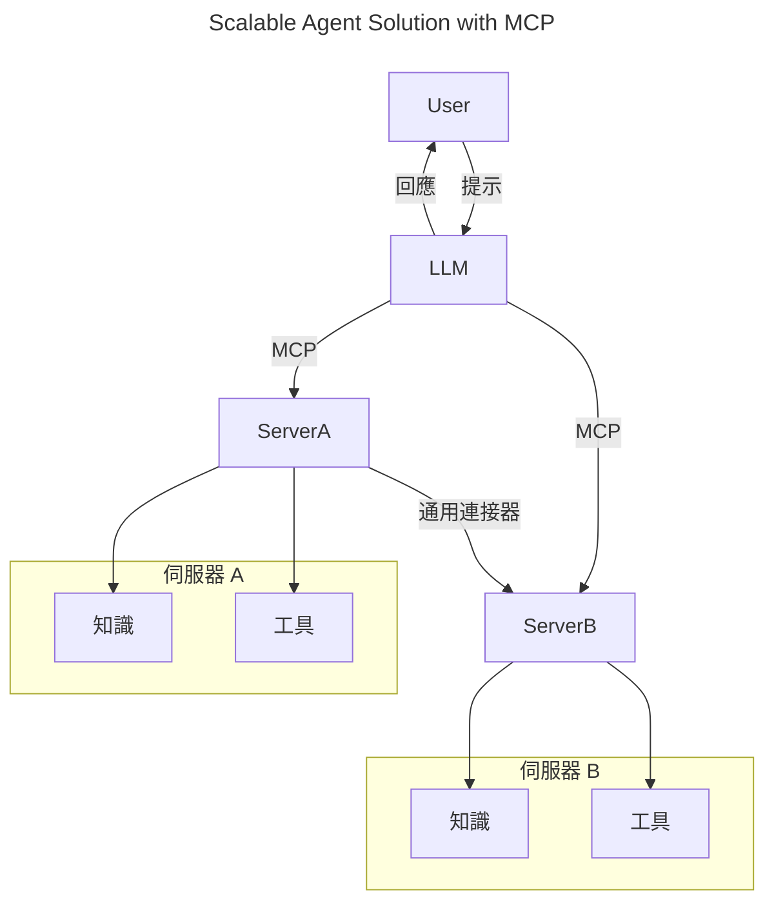
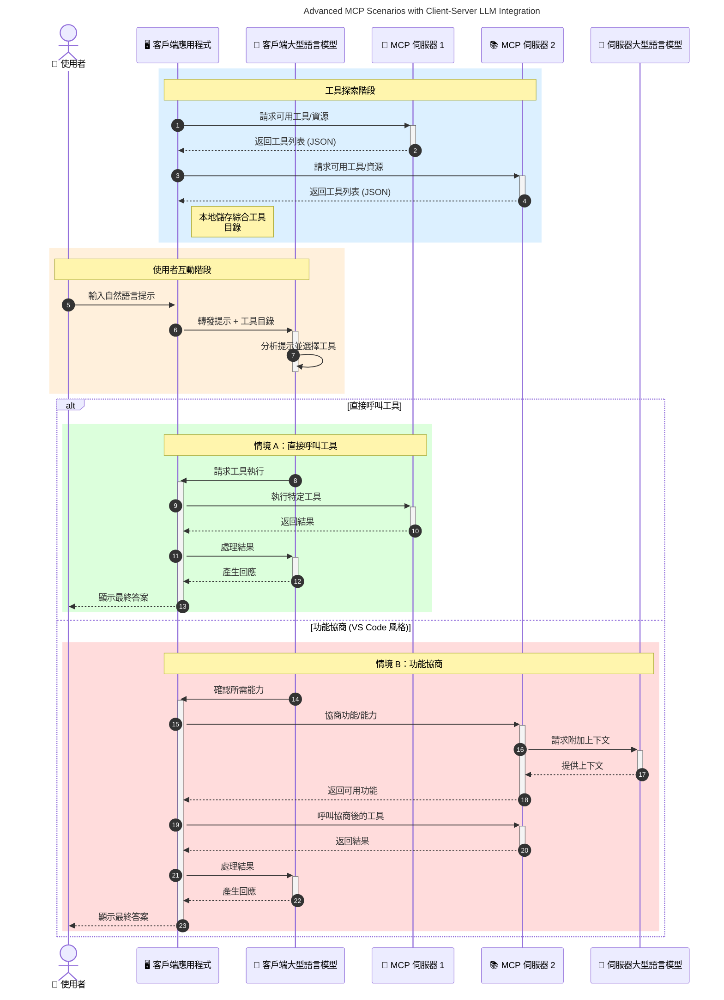

# 模型語境協議 (MCP) 簡介：為何它對可擴展 AI 應用重要

[](https://youtu.be/agBbdiOPLQA)

_(點擊以上圖片觀看本課程視頻)_

生成式 AI 應用是一大進步，因為它們常讓用戶使用自然語言提示與應用互動。然而，隨著投入更多時間和資源於此類應用，你想確保能輕鬆整合功能與資源，使得容易擴展，應用能支援多個模型共存，及處理各種模型細節。簡言之，構建生成式 AI 應用起步簡單，但當它們成長並變得更加複雜時，就需要開始定義一套架構，並可能需依賴標準來確保你的應用以一致方式構建。這正是 MCP 的作用，它用以組織並提供一套標準。

---

## **🔍 什麼是模型語境協議 (MCP)？**

**模型語境協議 (MCP)** 是一個 **開放、標準化的介面**，允許大型語言模型（LLM）與外部工具、API 和資料來源無縫互動。它提供一致架構來強化 AI 模型超越訓練資料的功能，促使 AI 系統更智能、可擴展且回應更快。

---

## **🎯 為何 AI 標準化至關重要**

隨著生成式 AI 應用愈加複雜，採用標準以確保 **可擴展性、可擴充性、可維護性** 以及 <strong>避免供應商鎖定</strong> 是非常必要的。MCP 回應了這些需求，透過：

- 統一模型與工具的整合
- 減少脆弱、一次性自訂解決方案
- 允許來自不同供應商的多個模型在同一生態系統共存

**注意：** 雖然 MCP 標榜為開放標準，但目前無計劃透過 IEEE、IETF、W3C、ISO 或其他標準機構正式標準化 MCP。

---

## **📚 學習目標**

讀完本文後，你將能夠：

- 定義 **模型語境協議 (MCP)** 及其應用場景
- 了解 MCP 如何標準化模型到工具的通信
- 辨識 MCP 架構的核心組件
- 探索 MCP 在企業與開發環境的實際應用

---

## **💡 為何模型語境協議 (MCP) 是一個變革者**

### **🔗 MCP 解決 AI 互動的零碎問題**

在 MCP 出現之前，模型與工具整合需：

- 每個工具-模型對需自訂程式碼
- 供應商間非標準化 API
- 更新頻繁導致中斷
- 工具增加時擴展性差

### **✅ MCP 標準化的優勢**

| <strong>優勢</strong>                 | <strong>說明</strong>                                                                     |
|--------------------------|-----------------------------------------------------------------------------|
| 互通性                   | LLM 可與不同供應商的工具無縫協作                                            |
| 一致性                   | 在不同平台和工具間維持一致行為                                              |
| 可重用性                 | 工具一次建置即可跨專案和系統使用                                            |
| 加速開發                 | 使用標準化、即插即用的介面減少開發時間                                      |

---

## **🧱 MCP 高階架構概覽**

MCP 採用 **客戶端-伺服器模型**，具體如下：

- **MCP 主機** 執行 AI 模型
- **MCP 客戶端** 發起請求
- **MCP 伺服器** 提供語境、工具和功能

### **核心組件：**

- <strong>資源</strong> – 模型使用的靜態或動態資料  
- <strong>提示</strong> – 預先定義的流程以引導產生內容  
- <strong>工具</strong> – 可執行的功能如搜尋、計算  
- <strong>取樣</strong> – 透過遞迴互動展現主動行為（於 `2026-07-28` 版候選中已棄用）
- <strong>引導</strong> – 由伺服器啟動的用戶輸入請求
- <strong>根目錄</strong> – 伺服器存取控制的檔案系統邊界（於 `2026-07-28` 版候選中已棄用）

### **協議架構：**

MCP 採用雙層架構：
- <strong>資料層</strong>：基於 JSON-RPC 2.0 通訊，配備生命週期管理與原語
- <strong>傳輸層</strong>：STDIO（本地）與支援 SSE 的串流 HTTP（遠端）通訊通道

---

## MCP 伺服器的運作方式

MCP 伺服器的運作方式如下：

- <strong>請求流程</strong>：
    1. 請求由最終用戶或其代理的軟體發起。
    2. **MCP 客戶端** 將請求發送至管理 AI 模型執行階段的 **MCP 主機**。
    3. **AI 模型** 接收用戶提示，並可能通過一個或多個工具呼叫請求外部工具或資料訪問。
    4. **MCP 主機**（非模型本身）以標準協議與適當的 **MCP 伺服器** 通訊。
- **MCP 主機功能**：
    - <strong>工具註冊表</strong>：維護可用工具及其功能目錄。
    - <strong>身份驗證</strong>：驗證工具存取權限。
    - <strong>請求處理器</strong>：處理模型發起的工具請求。
    - <strong>回應格式器</strong>：將工具輸出結構化為模型可理解的格式。
- **MCP 伺服器執行**：
    - **MCP 主機** 將工具呼叫路由至一個或多個提供專門功能（如搜尋、計算、資料庫查詢）的 **MCP 伺服器**。
    - **MCP 伺服器** 執行相關操作，並以一致格式將結果回傳給 **MCP 主機**。
    - **MCP 主機** 格式化並轉發這些結果給 **AI 模型**。
- <strong>回應完成</strong>：
    - **AI 模型** 將工具輸出整合為最終回應。
    - **MCP 主機** 將此回應返回給 **MCP 客戶端**，進一步交付給最終用戶或調用軟體。
    

```mermaid
---
title: MCP Architecture and Component Interactions
description: A diagram showing the flows of the components in MCP.
---
graph TD
    Client[MCP 用戶端/應用程式] -->|發送請求| H[MCP 主機]
    H -->|調用| A[AI 模型]
    A -->|工具呼叫請求| H
    H -->|MCP Protocol| T1[MCP Server Tool 01: 網絡搜尋]
    H -->|MCP Protocol| T2[MCP Server Tool 02: 計算機工具]
    H -->|MCP Protocol| T3[MCP Server Tool 03: 資料庫存取工具]
    H -->|MCP Protocol| T4[MCP Server Tool 04: 檔案系統工具]
    H -->|發送回應| Client

    subgraph 「MCP 主機組件」
        H
        G[工具註冊表]
        I[認證]
        J[請求處理器]
        K[回應格式化器]
    end

    H <--> G
    H <--> I
    H <--> J
    H <--> K

    style A fill:#f9d5e5,stroke:#333,stroke-width:2px
    style H fill:#eeeeee,stroke:#333,stroke-width:2px
    style Client fill:#d5e8f9,stroke:#333,stroke-width:2px
    style G fill:#fffbe6,stroke:#333,stroke-width:1px
    style I fill:#fffbe6,stroke:#333,stroke-width:1px
    style J fill:#fffbe6,stroke:#333,stroke-width:1px
    style K fill:#fffbe6,stroke:#333,stroke-width:1px
    style T1 fill:#c2f0c2,stroke:#333,stroke-width:1px
    style T2 fill:#c2f0c2,stroke:#333,stroke-width:1px
    style T3 fill:#c2f0c2,stroke:#333,stroke-width:1px
    style T4 fill:#c2f0c2,stroke:#333,stroke-width:1px
```

## 👨‍💻 如何構建 MCP 伺服器（帶範例）

MCP 伺服器讓你可透過提供資料和功能來擴展 LLM 的能力。

準備好試試看了嗎？以下為不同語言及技術棧的 SDK 及建立簡單 MCP 伺服器的示例：

- **Python SDK**: https://github.com/modelcontextprotocol/python-sdk

- **TypeScript SDK**: https://github.com/modelcontextprotocol/typescript-sdk

- **Java SDK**: https://github.com/modelcontextprotocol/java-sdk

- **C#/.NET SDK**: https://github.com/modelcontextprotocol/csharp-sdk


## 🌍 MCP 的真實案例

MCP 透過擴展 AI 功能，支持多種應用：

| <strong>應用</strong>                  | <strong>說明</strong>                                                                     |
|---------------------------|-----------------------------------------------------------------------------|
| 企業資料整合             | 連接 LLM 與資料庫、CRM 或內部工具                                          |
| 主動式 AI 系統           | 啟用具工具存取和決策工作流的自主代理                                        |
| 多模態應用               | 結合文字、圖像和音訊工具於單一 AI 應用                                      |
| 即時資料整合             | 將即時資料帶入 AI 互動以產生更準確即時的輸出                                |


### 🧠 MCP = AI 互動的通用標準

模型語境協議（MCP）充當 AI 互動的通用標準，就像 USB-C 標準化了設備的實體連接一樣。在 AI 世界中，MCP 提供一致介面，允許模型（客戶端）無縫整合外部工具和資料提供者（伺服器）。這消除每個 API 或資料來源需使用多樣自訂協議的需求。

根據 MCP，一個兼容 MCP 的工具（稱為 MCP 伺服器）遵從統一標準。這些伺服器可列出其提供的工具或行動，並在 AI 代理請求時執行這些行動。支援 MCP 的 AI 代理平台能發現伺服器的可用工具，並透過此標準協議呼叫它們。

### 💡 促進知識存取

除了提供工具外，MCP 也促進知識存取。它讓應用能將語境提供給大型語言模型（LLM），透過將它們連結到各種資料來源。例如，MCP 伺服器可能代表公司文件庫，允許代理按需檢索相關資訊。另一個伺服器可執行特定操作，如發送電子郵件或更新記錄。對代理而言，這些都是它可用的工具 — 有些工具回傳資料（知識語境），其他則執行行動。MCP 高效管理兩者。

連接至 MCP 伺服器的代理能透過標準格式自動了解伺服器可用的功能和可存取的資料。這種標準使工具的可用性動態化。舉例來說，在代理系統中新增一個 MCP 伺服器，其功能即可立即使用，無需進一步調整代理指令。

此簡化整合與下列圖示流程相符，該圖中伺服器同時提供工具與知識，確保系統間無縫協作。

### 👉 範例：可擴展代理解決方案


通用連接器允許 MCP 伺服器間溝通與能力共享，使 ServerA 可將任務委派給 ServerB 或存取其工具和知識。這促成伺服器間工具和資料的聯合，支援可擴展且模組化的代理架構。因 MCP 標準化工具暴露，代理能動態發現並在伺服器間路由請求，無需硬編碼整合。


工具與知識的聯合：工具與資料可跨伺服器訪問，使代理架構更具擴展性和模組化。

### 🔄 帶客戶端 LLM 集成的進階 MCP 場景

除了基本 MCP 架構外，也有進階場景，雙方（客戶端與伺服器）均包含 LLM，使互動更複雜。以下圖中，<strong>客戶端應用程式</strong> 可能是具多個 MCP 工具供 LLM 使用的 IDE：



## 🔐 MCP 的實際好處

以下為使用 MCP 的實際好處：

- <strong>資訊新鮮度</strong>：模型可存取比其訓練資料更即時的資訊
- <strong>能力擴展</strong>：模型可利用未被訓練過的專門工具執行任務
- <strong>減少幻覺</strong>：外部資料源提供事實依據
- <strong>隱私性</strong>：敏感資料可保留在安全環境，不嵌入提示中

## 📌 主要結論

以下為使用 MCP 的主要結論：

- **MCP** 標準化 AI 模型與工具及資料的互動方式
- 促進 **可擴充性、一致性與互通性**
- MCP 幫助 **減少開發時間、提升可靠性、擴展模型能力**
- 客戶端-伺服器結構 **實現靈活且可擴充的 AI 應用**

## 🧠 練習

思考一個你有興趣構建的 AI 應用。

- 哪些 <strong>外部工具或資料</strong> 可以增強其功能？
- MCP 怎樣使整合變得 **更簡單且更可靠？**

## 附加資源

- [MCP GitHub 倉庫](https://github.com/modelcontextprotocol)


## 接下來閱讀

下一章：[第一章：核心概念](../01-CoreConcepts/README.md)

---

<!-- CO-OP TRANSLATOR DISCLAIMER START -->
**免責聲明**：
本文件使用 AI 翻譯服務 [Co-op Translator](https://github.com/Azure/co-op-translator) 進行翻譯。雖然我們力求準確，但請注意，自動翻譯可能包含錯誤或不準確之處。原始文件的母語版本應被視為權威來源。對於重要資訊，建議尋求專業人工翻譯。我們不對因使用本翻譯而引起的任何誤解或曲解承擔責任。
<!-- CO-OP TRANSLATOR DISCLAIMER END -->