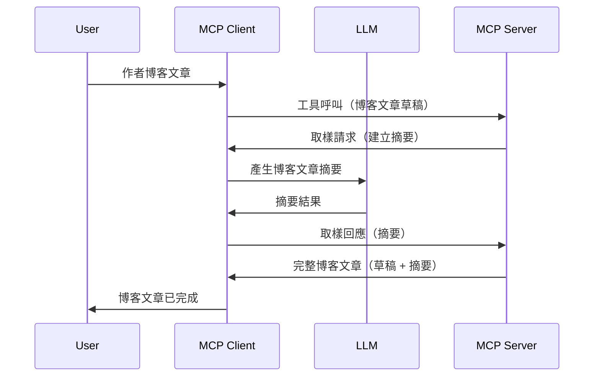

> [已棄用：2026-07-28 發佈候選版本](https://blog.modelcontextprotocol.io/posts/2026-07-28-release-candidate/)

# 取樣 - 將功能委派給客戶端

> **棄用通知：** `2026-07-28` MCP 規範發佈候選版本標記取樣為棄用，建議改為直接整合 LLM 服務提供者 API。取樣仍在 `2025-11-25` 版本可用，且在正式棄用後至少持續一年，因此本課程內容依然有效 — 但新伺服器設計應評估替代方案。詳見 [MCP 變更內容：2026-07-28 發佈候選版本](../../01-CoreConcepts/mcp-2026-07-28-release-candidate.md)。

有時候，您需要 MCP 客戶端和 MCP 伺服器協作以達成共同目標。可能會有伺服器需要駐留在客戶端的 LLM 幫助的情況。對此情況，您應使用取樣。

讓我們探討一些用例以及如何建立涉及取樣的解決方案。

## 概覽

在本課程中，我們將專注說明何時何地使用取樣以及如何配置取樣。

## 學習目標

在本章，我們將：

- 解釋什麼是取樣以及何時使用。
- 演示如何在 MCP 中配置取樣。
- 提供取樣實作範例。

## 什麼是取樣及為何使用它？

取樣是一項進階功能，其運作方式如下：



### 取樣請求

好的，現在我們已大致了解一個可信的場景，接著來談談伺服器發送回客戶端的取樣請求。此類請求在 JSON-RPC 格式下可能長這樣：

```json
{
  "jsonrpc": "2.0",
  "id": 1,
  "method": "sampling/createMessage",
  "params": {
    "messages": [
      {
        "role": "user",
        "content": {
          "type": "text",
          "text": "Create a blog post summary of the following blog post: <BLOG POST>"
        }
      }
    ],
    "modelPreferences": {
      "hints": [
        {
          "name": "claude-3-sonnet"
        }
      ],
      "intelligencePriority": 0.8,
      "speedPriority": 0.5
    },
    "systemPrompt": "You are a helpful assistant.",
    "maxTokens": 100
  }
}
```

這裡有幾點值得注意：

- 內容下的提示（content -> text）是我們的提示語，是指示 LLM 摘要部落格文章內容的指令。

- **modelPreferences**。該部分僅為偏好設定，建議用於 LLM 的配置。使用者可選擇接受這些建議或自行更改。本例中建議用於模型及速度和智能優先順序的設定。
- **systemPrompt**，這是你的常規系統提示，為 LLM 設定個性與提供指導指令。
- **maxTokens**，此屬性用以表示建議任務可使用的最大 token 數量。

### 取樣回應

這是 MCP 客戶端最終回傳給 MCP 伺服器的回應，是客戶端呼叫 LLM、等待回應後構造出的訊息。以下為 JSON-RPC 格式範例：

```json
{
  "jsonrpc": "2.0",
  "id": 1,
  "result": {
    "role": "assistant",
    "content": {
      "type": "text",
      "text": "Here's your abstract <ABSTRACT>"
    },
    "model": "gpt-5",
    "stopReason": "endTurn"
  }
}
```

請注意回應是部落格文章的摘要，正是我們所要求的。另請注意所使用的 `model` 並非我們指定，而是用 "gpt-5" 取代了 "claude-3-sonnet"。此用例說明了使用者可以改變想法選擇使用的模型，而你的取樣請求僅為建議。

好的，現在我們了解主要流程以及可用於「撰寫部落格文章 + 摘要」的實用任務，接著來看看我們需要如何讓它運作。

### 訊息類型

取樣訊息不只限於文字，也可傳送圖片與音訊。以下為 JSON-RPC 格式的差異示例：

<strong>文字內容</strong>

```json
{
  "type": "text",
  "text": "The message content"
}
```

<strong>圖片內容</strong>

```json
{
  "type": "image",
  "data": "base64-encoded-image-data",
  "mimeType": "image/jpeg"
}
```

<strong>音訊內容</strong>

```json
{
  "type": "audio",
  "data": "base64-encoded-audio-data",
  "mimeType": "audio/wav"
}
```

> 注意：關於取樣的詳細資訊，請參考 [官方文件](https://modelcontextprotocol.io/specification/2025-11-25/client/sampling)

## 如何在客戶端配置取樣

> 注意：如果你只建立伺服器，此處無需太多操作。

客戶端需要如此指定以下功能：

```json
{
  "capabilities": {
    "sampling": {}
  }
}
```

這將在所選客戶端與伺服器初始化時被擷取。

## 取樣實作範例 - 建立一篇部落格文章

讓我們一起編寫取樣伺服器，需要做如下幾點：

1. 在伺服器建立一個工具。
1. 該工具應產生一個取樣請求。
1. 等待客戶端答覆取樣請求。
1. 產生該工具結果。

讓我們逐步檢視代碼：

### -1- 建立工具

**python**

```python
@mcp.tool()
async def create_blog(title: str, content: str, ctx: Context[ServerSession, None]) -> str:
    """Create a blog post and generate a summary"""

```

### -2- 建立取樣請求

擴充你的工具，加入以下代碼：

**python**

```python
post = BlogPost(
        id=len(posts) + 1,
        title=title,
        content=content,
        abstract=""
    )

prompt = f"Create an abstract of the following blog post: title: {title} and draft: {content} "

result = await ctx.session.create_message(
        messages=[
            SamplingMessage(
                role="user",
                content=TextContent(type="text", text=prompt),
            )
        ],
        max_tokens=100,
)

```

### -3- 等待回應並回傳回應

**python**

```python
post.abstract = result.content.text

posts.append(post)

# 返回完整的產品
return json.dumps({
    "id": post.title,
    "abstract": post.abstract
})
```

### -4- 完整程式碼

**python**

```python
from starlette.applications import Starlette
from starlette.routing import Mount, Host

from mcp.server.fastmcp import Context, FastMCP

from mcp.server.session import ServerSession
from mcp.types import SamplingMessage, TextContent

import json


from uuid import uuid4
from typing import List
from pydantic import BaseModel


mcp = FastMCP("Blog post generator")

# app = FastAPI()

posts = []

class BlogPost(BaseModel):
    id: int
    title: str
    content: str
    abstract: str

posts: List[BlogPost] = []

@mcp.tool()
async def create_blog(title: str, content: str, ctx: Context[ServerSession, None]) -> str:
    """Create a blog post and generate a summary"""

    post = BlogPost(
        id=len(posts) + 1,
        title=title,
        content=content,
        abstract=""
    )

    prompt = f"Create an abstract of the following blog post: title: {title} and draft: {content} "

    result = await ctx.session.create_message(
        messages=[
            SamplingMessage(
                role="user",
                content=TextContent(type="text", text=prompt),
            )
        ],
        max_tokens=100,
    )

    post.abstract = result.content.text

    posts.append(post)

    # 返回完整的博客文章
    return json.dumps({
        "id": post.title,
        "abstract": post.abstract
    })

if __name__ == "__main__":
    print("Starting server...")
    # mcp.run()
    mcp.run(transport="streamable-http")

# 使用以下指令執行應用程式：python server.py
```

### -5- 在 Visual Studio Code 測試

在 Visual Studio Code 測試可按以下步驟：

1. 在終端機啟動伺服器
1. 將它加到 *mcp.json*（並確保伺服器已啟動），例如：

   ```json
   "servers": {
      "blog-server": {
        "type": "http",
        "url": "http://localhost:8000/mcp"
      }
   }
   ```

1. 輸入提示詞：

   ```text
   create a blog post named "Where Python comes from", the content is "Python is actually named after Monty Python Flying Circus"
   ```

1. 允許取樣進行。首次測試時，系統會彈出額外對話框需你接受，接著才會出現詢問是否執行工具的正常對話框。

1. 檢查結果。結果會在 GitHub Copilot Chat 美觀呈現，你也可檢視原始 JSON 回應。

<strong>額外資訊</strong>。Visual Studio Code 工具對取樣有良好支援。你可透過以下方式配置已安裝伺服器的取樣存取權限：

1. 前往擴充功能區域。
1. 在「MCP SERVERS - INSTALLED」區段選擇已安裝伺服器的齒輪圖示。
1. 選擇「Configure Model Access」，此處可指定 GitHub Copilot 進行取樣時允許使用的模型。也可藉由選擇「Show Sampling requests」查看近期所有取樣請求。

## 作業

在此作業中，你將建置稍有不同的取樣功能，即支援產生產品描述的取樣整合。以下是情境說明：

<strong>情境</strong>：電子商務後台員工需要幫助，產生產品描述耗費時間過長。你需建立一個可呼叫名為「create_product」工具，帶入「title」與「keywords」參數，產出完整產品資訊，其中「description」欄位應由客戶端 LLM 填充。

提示：運用先前學到的知識，利用取樣請求構造此伺服器及工具。

## 解決方案

[解決方案](./solution/README.md)

## 主要重點

取樣是功能強大的特性，允許伺服器在需要 LLM 幫助時將任務委派給客戶端。

## 往後看

- [第 4 章 - 實務實作](../../04-PracticalImplementation/README.md)

---

<!-- CO-OP TRANSLATOR DISCLAIMER START -->
**免責聲明**：
本文件使用 AI 翻譯服務 [Co-op Translator](https://github.com/Azure/co-op-translator) 進行翻譯。雖然我們力求準確，但請注意，自動翻譯可能包含錯誤或不準確之處。原始文件的母語版本應被視為權威來源。對於重要資訊，建議尋求專業人工翻譯。我們不對因使用本翻譯而引起的任何誤解或曲解承擔責任。
<!-- CO-OP TRANSLATOR DISCLAIMER END -->