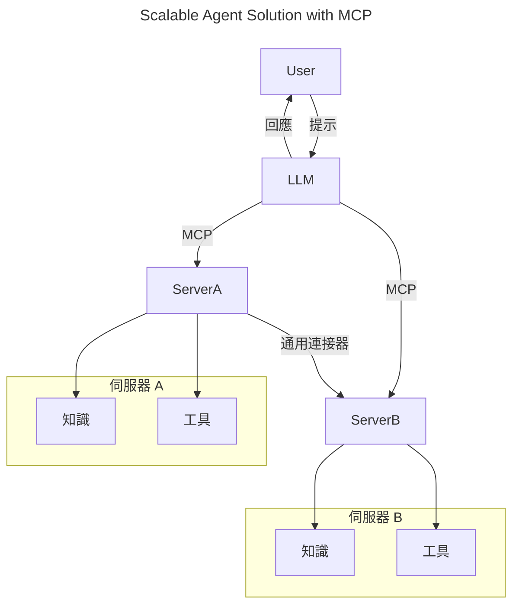
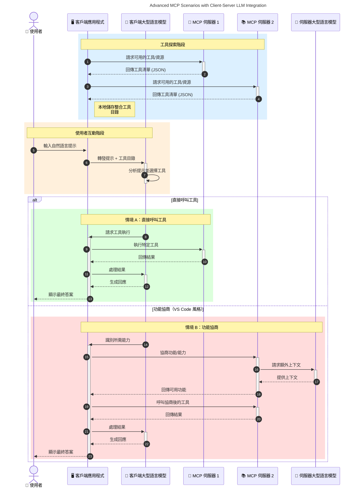

# 模型語境協議（MCP）導論：為何它對可擴展的 AI 應用程式至關重要

[](https://youtu.be/agBbdiOPLQA)

_(點擊上方圖片觀看本課視頻)_

生成型 AI 應用程式是向前邁出的一大步，因為它們通常允許使用者透過自然語言提示與應用程式互動。然而，隨著更多時間和資源投入這些應用程式，您會希望能輕鬆整合功能和資源，使系統易於擴展，能支援多個模型的使用，並處理各種模型的細節。簡言之，構建生成型 AI 應用程式一開始很簡單，但當它們成長且變得更複雜時，您需要開始定義架構，並可能需要依賴一個標準，確保應用的構建方式一致。這正是 MCP 用來組織並提供標準的地方。

---

## **🔍 什麼是模型語境協議（MCP）？**

**模型語境協議（MCP）** 是一個 <strong>開放且標準化的介面</strong>，允許大型語言模型（LLM）與外部工具、API 及資料來源無縫互動。它提供一致的架構，增強 AI 模型功能，突破訓練數據限制，實現更智能、可擴展且更具回應性的 AI 系統。

---

## **🎯 為何 AI 需要標準化**

隨著生成型 AI 應用程式變得越來越複雜，採用標準化確保 **可擴展性、可延伸性、可維護性** 以及 <strong>避免廠商鎖定</strong> 變得至關重要。MCP 回應這些需求，具體表現在：

- 統一模型與工具的整合
- 減少脆弱且一次性的客製化解決方案
- 允許多個不同廠商的模型共存於同一生態系統

**注意：** 儘管 MCP 自稱為開放標準，但並無計畫通過 IEEE、IETF、W3C、ISO 或其他任何既有標準組織進行標準化。

---

## **📚 學習目標**

閱讀本文後，您將能夠：

- 定義 **模型語境協議（MCP）** 及其使用案例
- 了解 MCP 如何標準化模型與工具間的通訊
- 識別 MCP 架構的核心組件
- 探索 MCP 在企業與開發場景中的實際應用

---

## **💡 為何模型語境協議（MCP）是顛覆者**

### **🔗 MCP 解決 AI 互動分散問題**

在 MCP 之前，模型與工具整合需：

- 為每組工具-模型寫客製程式碼
- 使用每個廠商各自非標準 API
- 隨著更新經常中斷
- 新增工具時擴展性差

### **✅ MCP 標準化的益處**

| <strong>益處</strong>                    | <strong>描述</strong>                                                                    |
|----------------------------|----------------------------------------------------------------------------|
| 互通性                     | 大型語言模型可與不同廠商的工具無縫協作                                     |
| 一致性                     | 各平台與工具行為統一                                                        |
| 可重用性                   | 一次構建的工具可跨多專案及系統使用                                         |
| 加速開發                   | 採用標準化即插即用介面縮短開發時間                                         |

---

## **🧱 高階 MCP 架構概覽**

MCP 採用 **客戶端-伺服器模式**，其中：

- **MCP 主機** 執行 AI 模型
- **MCP 用戶端** 發起請求
- **MCP 伺服器** 提供語境、工具與功能

### **主要組件：**

- <strong>資源</strong> – 靜態或動態資料供模型使用  
- <strong>提示</strong> – 預定義流程引導生成  
- <strong>工具</strong> – 可執行功能，如搜尋、計算  
- <strong>抽樣</strong> – 透過遞迴互動實現智能代理行為（於 `2026-07-28` 發行候選版後棄用）
- <strong>引導</strong> – 伺服器發起的用戶輸入請求
- <strong>根目錄</strong> – 伺服器存取控制的檔案系統邊界（於 `2026-07-28` 發行候選版後棄用）

### **協議架構：**

MCP 採用兩層架構：
- <strong>數據層</strong>：基於 JSON-RPC 2.0 的通信，具生命周期管理與原語支援
- <strong>傳輸層</strong>：本地 STDIO 和遠端帶有 SSE 的可串流 HTTP 通訊管道

---

## MCP 伺服器如何運作

MCP 伺服器運行方式如下：

- <strong>請求流程</strong>：
    1. 請求由最終用戶或其代理軟體發起。
    2. **MCP 用戶端** 將請求送至管理 AI 模型執行的 **MCP 主機**。
    3. **AI 模型** 接收用戶提示，並可能透過一或多個工具呼叫請求存取外部工具或資料。
    4. **MCP 主機**（而非模型本身）使用標準協議與對應的 **MCP 伺服器** 進行通訊。
- **MCP 主機功能**：
    - <strong>工具註冊表</strong>：維護可使用工具及其能力的目錄。
    - <strong>認證</strong>：驗證工具存取權限。
    - <strong>請求處理器</strong>：處理模型提出的工具請求。
    - <strong>回應格式化器</strong>：將工具輸出整理成模型可理解的格式。
- **MCP 伺服器執行**：
    - **MCP 主機** 將工具呼叫路由至一個或多個 **MCP 伺服器**，各自暴露特定功能（如搜尋、計算、資料庫查詢）。
    - **MCP 伺服器** 執行其操作並以統一格式將結果返回給 **MCP 主機**。
    - **MCP 主機** 將結果格式化並轉送給 **AI 模型**。
- <strong>回應完成</strong>：
    - **AI 模型** 將工具輸出整合進最終回答中。
    - **MCP 主機** 將此回答發送回 **MCP 用戶端**，由用戶端交付給最終用戶或呼叫軟體。
    

```mermaid
---
title: MCP Architecture and Component Interactions
description: A diagram showing the flows of the components in MCP.
---
graph TD
    Client[MCP 用戶端/應用程式] -->|發送請求| H[MCP 主機]
    H -->|調用| A[AI 模型]
    A -->|工具呼叫請求| H
    H -->|MCP Protocol| T1[MCP Server Tool 01: 網路搜尋]
    H -->|MCP Protocol| T2[MCP Server Tool 02: 計算器工具]
    H -->|MCP Protocol| T3[MCP Server Tool 03: 資料庫存取工具]
    H -->|MCP Protocol| T4[MCP Server Tool 04: 檔案系統工具]
    H -->|發送回應| Client

    subgraph 「MCP 主機元件」
        H
        G[工具註冊中心]
        I[身份驗證]
        J[請求處理器]
        K[回應格式化器]
    end

    H <--> G
    H <--> I
    H <--> J
    H <--> K

    style A fill:#f9d5e5,stroke:#333,stroke-width:2px
    style H fill:#eeeeee,stroke:#333,stroke-width:2px
    style Client fill:#d5e8f9,stroke:#333,stroke-width:2px
    style G fill:#fffbe6,stroke:#333,stroke-width:1px
    style I fill:#fffbe6,stroke:#333,stroke-width:1px
    style J fill:#fffbe6,stroke:#333,stroke-width:1px
    style K fill:#fffbe6,stroke:#333,stroke-width:1px
    style T1 fill:#c2f0c2,stroke:#333,stroke-width:1px
    style T2 fill:#c2f0c2,stroke:#333,stroke-width:1px
    style T3 fill:#c2f0c2,stroke:#333,stroke-width:1px
    style T4 fill:#c2f0c2,stroke:#333,stroke-width:1px
```

## 👨‍💻 如何構建 MCP 伺服器（含範例）

MCP 伺服器允許您擴展 LLM 的能力，提供資料和功能。

準備好試試看了嗎？以下是語言和/或技術棧專屬的 SDK 及不同語言/棧中建立簡單 MCP 伺服器的範例：

- **Python SDK**: https://github.com/modelcontextprotocol/python-sdk

- **TypeScript SDK**: https://github.com/modelcontextprotocol/typescript-sdk

- **Java SDK**: https://github.com/modelcontextprotocol/java-sdk

- **C#/.NET SDK**: https://github.com/modelcontextprotocol/csharp-sdk


## 🌍 MCP 的真實世界應用

MCP 通過擴展 AI 能力實現多種應用：

| <strong>應用場景</strong>                | <strong>描述</strong>                                                                |
|----------------------------|------------------------------------------------------------------------|
| 企業資料整合               | 連接大型語言模型到資料庫、客戶關係管理系統或內部工具                 |
| 代理型 AI 系統             | 使自治代理擁有工具存取與決策工作流程                                 |
| 多模態應用                 | 在單一統一 AI 應用中結合文本、影像和音訊工具                         |
| 即時資料整合               | 將實時資料引入 AI 互動，提供更準確與最新的輸出                       |


### 🧠 MCP = AI 互動的通用標準

模型語境協議（MCP）就像 USB-C 標準化了裝置的物理連接，成為 AI 互動的通用標準。在 AI 領域中，MCP 提供一致介面，允許客戶端模型無縫整合外部工具和資料供應方（伺服器）。這消除了每個 API 或資料來源需要不同客製協議的需求。

根據 MCP，MCP 兼容的工具（稱為 MCP 伺服器）遵循統一標準。這些伺服器能列出它們提供的工具或操作，並在 AI 代理請求時執行。支援 MCP 的 AI 代理平台能發現伺服器上的可用工具，透過此標準協定呼叫它們。

### 💡 促進知識存取

除了提供工具，MCP 亦促進知識存取。它讓應用能為大型語言模型（LLM）提供語境，透過連結多種資料來源。例如，MCP 伺服器可能代表公司的文件庫，允許代理按需檢索相關資訊。另一個伺服器可能處理特定操作，如發送電子郵件或更新紀錄。對代理而言，它們都是可用工具—有些工具回傳數據（知識語境），有些則執行操作。MCP 高效管理兩者。

與 MCP 伺服器連接的代理可自動透過標準格式了解伺服器的可用能力和可存取資料。此標準化允許動態工具可用性。舉例來說，在代理系統新增 MCP 伺服器，其功能即刻可用，無需額外客製代理指令。

此簡化整合符合以下圖示流程，伺服器提供工具及知識，確保系統間無縫協作。

### 👉 範例：可擴展代理解決方案


「通用連接器」讓 MCP 伺服器間通訊並共享功能，使 ServerA 可以將任務委派給 ServerB，或存取其工具和知識。這在伺服器間實現工具與資料聯邦，支持可擴展且模組化的代理架構。因為 MCP 標準化了工具暴露，代理可動態發現並透過該標準協議在伺服器間路由請求，無需硬編碼整合。


工具與知識聯邦：可跨伺服器存取工具和資料，實現更可擴展且模組化的代理架構。

### 🔄 進階 MCP 場景：客戶端帶 LLM 的整合

除了基本 MCP 架構外，還有進階場景中客戶端與伺服器均包含 LLM，使互動更複雜。下圖展示，<strong>客戶端應用</strong> 可能是一個 IDE，提供多種 MCP 工具供 LLM 使用：



## 🔐 MCP 的實際優勢

使用 MCP 的實際益處包括：

- <strong>最新資訊</strong>：模型能存取訓練數據之外的即時資訊
- <strong>能力擴展</strong>：模型能利用專門工具執行其未被訓練的任務
- <strong>減少幻覺</strong>：外部資料來源增加事實依據
- <strong>隱私保護</strong>：敏感資料可留在安全環境，不需嵌入提示

## 📌 主要結論

使用 MCP 的主要結論如下：

- **MCP** 標準化 AI 模型與工具及資料的互動方式
- 促進 **可延伸性、一致性及互通性**
- MCP 有助於 **減少開發時間、提升可靠度、擴展模型功能**
- 客戶端-伺服器架構 **支持靈活且可擴展的 AI 應用開發**

## 🧠 練習

想想您感興趣打造的 AI 應用程式。

- 哪些 <strong>外部工具或資料</strong> 能提升其能力？
- MCP 如何讓整合 <strong>更簡單且更可靠</strong>？

## 其他資源

- [MCP GitHub 倉庫](https://github.com/modelcontextprotocol)


## 下一步

下一章：[第 1 章：核心概念](../01-CoreConcepts/README.md)

---

<!-- CO-OP TRANSLATOR DISCLAIMER START -->
**免責聲明**：
此文件已使用 AI 翻譯服務 [Co-op Translator](https://github.com/Azure/co-op-translator) 進行翻譯。雖然我們努力追求準確性，但請注意自動翻譯可能包含錯誤或不準確之處。原始文件的母語版本應視為權威來源。對於關鍵資訊，建議採用專業人工翻譯。我們不對因使用此翻譯所產生的任何誤解或誤譯承擔責任。
<!-- CO-OP TRANSLATOR DISCLAIMER END -->