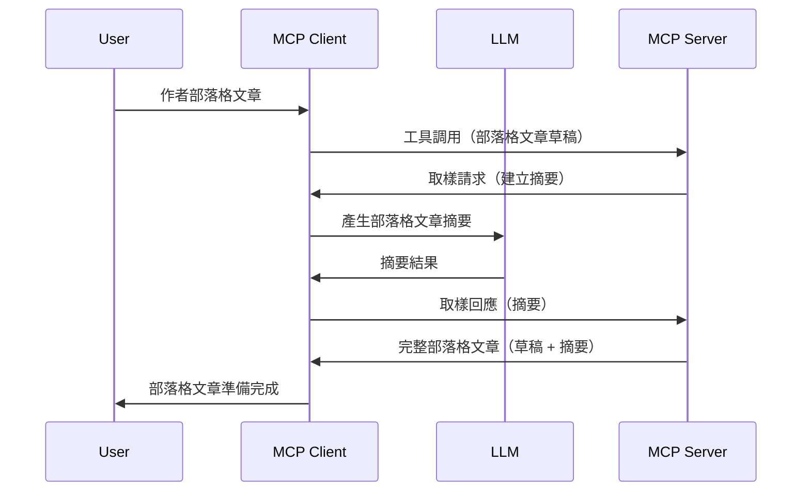

> [已棄用：2026-07-28 釋出候選版](https://blog.modelcontextprotocol.io/posts/2026-07-28-release-candidate/)

# 採樣 - 將功能委派給用戶端

> **棄用通知：** `2026-07-28` MCP 規範釋出候選版將採樣標記為棄用，改為直接整合 LLM 供應商 API。採樣在 `2025-11-25` 版本及正式棄用後至少一年內仍可使用，因此本課程內容依然有效 — 但新的伺服器設計應評估替代方案。詳見 [MCP 的變更：2026-07-28 釋出候選版](../../01-CoreConcepts/mcp-2026-07-28-release-candidate.md)。

有時，你需要 MCP 用戶端與 MCP 伺服器合作來達成共同目標。你可能會遇到伺服器需要客戶端上的 LLM 協助的情況。針對此情境，應使用採樣功能。

讓我們來探討一些使用案例以及如何建構包含採樣的解決方案。

## 概述

在本課程中，我們將聚焦說明何時何地使用採樣以及如何設定它。

## 學習目標

在本章中，我們會：

- 解釋什麼是採樣以及何時使用它。
- 示範如何在 MCP 中配置採樣。
- 提供採樣應用的範例。

## 什麼是採樣及為何使用它？

採樣是一項進階功能，其運作方式如下：



### 採樣請求

好的，現在我們對一個可信場景有了大致了解，接下來談談伺服器發回給用戶端的採樣請求。此類請求在 JSON-RPC 格式下可能長這樣：

```json
{
  "jsonrpc": "2.0",
  "id": 1,
  "method": "sampling/createMessage",
  "params": {
    "messages": [
      {
        "role": "user",
        "content": {
          "type": "text",
          "text": "Create a blog post summary of the following blog post: <BLOG POST>"
        }
      }
    ],
    "modelPreferences": {
      "hints": [
        {
          "name": "claude-3-sonnet"
        }
      ],
      "intelligencePriority": 0.8,
      "speedPriority": 0.5
    },
    "systemPrompt": "You are a helpful assistant.",
    "maxTokens": 100
  }
}
```

這裡有幾點值得說明：

- Prompt 中 content -> text 是我們用來指示 LLM 對部落格文章內容進行摘要的提示。

- **modelPreferences**。此區域即為偏好設置，是對應使用哪種 LLM 配置的建議。使用者可決定是否接受或修改這些建議。本例中建議了要使用的模型，以及速度與智慧優先的設定。
- **systemPrompt**，這是常規的系統提示，用以賦予 LLM 個性並包含指導性說明。
- **maxTokens**，此屬性用於表示推薦在此任務中使用的最大 token 數量。

### 採樣回應

這個回應即為 MCP 客戶端經過呼叫 LLM，等待結果後構造並返回給 MCP 伺服器的訊息。它在 JSON-RPC 格式中可能長這樣：

```json
{
  "jsonrpc": "2.0",
  "id": 1,
  "result": {
    "role": "assistant",
    "content": {
      "type": "text",
      "text": "Here's your abstract <ABSTRACT>"
    },
    "model": "gpt-5",
    "stopReason": "endTurn"
  }
}
```

請注意回應正是如我們所要求的部落格文章摘要。同時注意所使用的模型並非我們原先請求的，而是使用 "gpt-5" 而非 "claude-3-sonnet"。此範例用以說明使用者可以改變所用模型，而你的採樣請求為一種建議。

好，了解主要流程與用於「部落格文章撰寫 + 摘要」的實用任務後，接著看看啟用此功能需要做什麼。

### 訊息類型

採樣訊息並不限於純文字，還可以傳送圖片和音訊。下面示範 JSON-RPC 的差異：

<strong>文字</strong>

```json
{
  "type": "text",
  "text": "The message content"
}
```

<strong>圖片內容</strong>

```json
{
  "type": "image",
  "data": "base64-encoded-image-data",
  "mimeType": "image/jpeg"
}
```

<strong>音訊內容</strong>

```json
{
  "type": "audio",
  "data": "base64-encoded-audio-data",
  "mimeType": "audio/wav"
}
```

> 注意：欲取得更詳細的採樣資訊，請參閱[官方文件](https://modelcontextprotocol.io/specification/2025-11-25/client/sampling)

## 如何在用戶端配置採樣

> 注意：如果你只構建伺服器端，這裡幾乎不需多做什麼。

在用戶端，你需要像下面這樣指定以下功能：

```json
{
  "capabilities": {
    "sampling": {}
  }
}
```

這樣一來，當你選擇的用戶端初始化連接至伺服器時便會採用此設定。

## 採樣實戰範例 - 建立部落格文章

讓我們一起編寫採樣伺服器，將需要執行的步驟如下：

1. 在伺服器上建立一個工具。
1. 這個工具應建立採樣請求。
1. 工具需等待用戶端對採樣請求的回應。
1. 最後產生工具的結果。

讓我們分步看看程式碼：

### -1- 建立工具

**python**

```python
@mcp.tool()
async def create_blog(title: str, content: str, ctx: Context[ServerSession, None]) -> str:
    """Create a blog post and generate a summary"""

```

### -2- 建立採樣請求

在你的工具中加入以下程式碼：

**python**

```python
post = BlogPost(
        id=len(posts) + 1,
        title=title,
        content=content,
        abstract=""
    )

prompt = f"Create an abstract of the following blog post: title: {title} and draft: {content} "

result = await ctx.session.create_message(
        messages=[
            SamplingMessage(
                role="user",
                content=TextContent(type="text", text=prompt),
            )
        ],
        max_tokens=100,
)

```

### -3- 等待回應並返回

**python**

```python
post.abstract = result.content.text

posts.append(post)

# 返回完整產品
return json.dumps({
    "id": post.title,
    "abstract": post.abstract
})
```

### -4- 完整程式碼

**python**

```python
from starlette.applications import Starlette
from starlette.routing import Mount, Host

from mcp.server.fastmcp import Context, FastMCP

from mcp.server.session import ServerSession
from mcp.types import SamplingMessage, TextContent

import json


from uuid import uuid4
from typing import List
from pydantic import BaseModel


mcp = FastMCP("Blog post generator")

# app = FastAPI()

posts = []

class BlogPost(BaseModel):
    id: int
    title: str
    content: str
    abstract: str

posts: List[BlogPost] = []

@mcp.tool()
async def create_blog(title: str, content: str, ctx: Context[ServerSession, None]) -> str:
    """Create a blog post and generate a summary"""

    post = BlogPost(
        id=len(posts) + 1,
        title=title,
        content=content,
        abstract=""
    )

    prompt = f"Create an abstract of the following blog post: title: {title} and draft: {content} "

    result = await ctx.session.create_message(
        messages=[
            SamplingMessage(
                role="user",
                content=TextContent(type="text", text=prompt),
            )
        ],
        max_tokens=100,
    )

    post.abstract = result.content.text

    posts.append(post)

    # 返回完整的部落格文章
    return json.dumps({
        "id": post.title,
        "abstract": post.abstract
    })

if __name__ == "__main__":
    print("Starting server...")
    # mcp.run()
    mcp.run(transport="streamable-http")

# 使用以下指令執行應用程式：python server.py
```

### -5- 在 Visual Studio Code 測試

若要在 Visual Studio Code 中測試，請依照以下步驟：

1. 在終端機啟動伺服器
1. 將其加入 *mcp.json*（並確認已啟動），例如：

   ```json
   "servers": {
      "blog-server": {
        "type": "http",
        "url": "http://localhost:8000/mcp"
      }
   }
   ```

1. 輸入提示詞：

   ```text
   create a blog post named "Where Python comes from", the content is "Python is actually named after Monty Python Flying Circus"
   ```

1. 允許採樣進行。首次測試時，你會看到一個需接受的額外對話框，之後會看到正常的執行工具對話框。

1. 檢查結果。在 GitHub Copilot Chat 中可看到格式良好的結果呈現，亦可檢視原始 JSON 回應。

<strong>額外資訊</strong>。Visual Studio Code 工具對採樣有良好支援。你可以這樣配置已安裝伺服器的採樣存取權限：

1. 前往擴充功能區。
1. 在「MCP SERVERS - INSTALLED」區域，選擇你已安裝伺服器的齒輪圖示。
1. 選擇「Configure Model Access」，此處可選擇 GitHub Copilot 在執行採樣時允許使用哪些模型。你也可以選擇「Show Sampling requests」查看近期發生的採樣請求。

## 作業

本作業中，你將建立稍微不同的採樣整合——支援生成產品描述的採樣。以下是你的場景：

<strong>場景</strong>：電商後台工作者需要協助，產出產品描述花費太多時間。因此，你將建立一個方案，可以呼叫名為 "create_product" 的工具，並以 "title" 和 "keywords" 做為參數，產出完整產品，包括需由用戶端 LLM 填寫的 "description" 欄位。

提示：利用前面所學，透過採樣請求構建此伺服器及其工具。

## 解答

[解答](./solution/README.md)

## 重要重點

採樣是一項強大功能，允許伺服器在需要 LLM 協助時，將任務委派給用戶端。

## 後續步驟

- [第四章 - 實務實作](../../04-PracticalImplementation/README.md)

---

<!-- CO-OP TRANSLATOR DISCLAIMER START -->
**免責聲明**：
此文件已使用 AI 翻譯服務 [Co-op Translator](https://github.com/Azure/co-op-translator) 進行翻譯。雖然我們努力追求準確性，但請注意自動翻譯可能包含錯誤或不準確之處。原始文件的母語版本應視為權威來源。對於關鍵資訊，建議採用專業人工翻譯。我們不對因使用此翻譯所產生的任何誤解或誤譯承擔責任。
<!-- CO-OP TRANSLATOR DISCLAIMER END -->